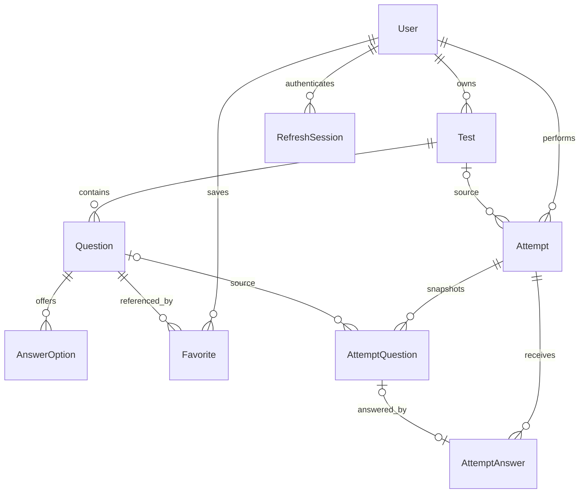

# Quiz Test

Платформа личных тестов: ручное создание, импорт PDF/HTML, прохождение, разбор ошибок и повторение избранных вопросов. Приложение использует FastAPI backend и PostgreSQL для хранения аккаунтов, тестов и результатов.

Все тесты приватные. Публичность и общий каталог не входят в проект. `Favorite` связывает пользователя с **вопросом**, а не с тестом.


## Возможности backend

- Регистрация, bcrypt, RSA JWT, ротация refresh-сессий в PostgreSQL и выход.
- Проверка владельца всех личных ресурсов.
- Создание и редактирование теста целиком или отдельных вопросов.
- Один правильный вариант, несколько вариантов, текст, пропуски, сопоставление.
- Импорт текстового PDF формата «Вопрос / Варианты ответа / Ответ» и сохранённых страниц вопросов SyncShare.
- Превью без записи в БД; сохранение исправленного содержимого одной транзакцией.
- Избранные вопросы и отдельная попытка по вопросам из нескольких своих тестов.
- Серверная проверка ответов, результат, ошибки, история и повторное прохождение.
- Снимки вопросов: правки и удаление исходного теста не меняют начатые попытки и результаты.
- Swagger, проверки состояния, Docker Compose и тесты PostgreSQL.

## Запуск через Docker

Из каталога `backend/`:

```bash
cp .env.example .env
```

Укажите реквизиты PostgreSQL в `.env`. Если база уже используется, сохраните существующие реквизиты и файлы ключей.

Для **нового окружения без ключей** создайте пару RSA:

```bash
mkdir -p api_v1/auth/certs
openssl genpkey -algorithm RSA -out api_v1/auth/certs/jwt-private.pem -pkeyopt rsa_keygen_bits:2048
chmod 600 api_v1/auth/certs/jwt-private.pem
openssl rsa -pubout -in api_v1/auth/certs/jwt-private.pem -out api_v1/auth/certs/jwt-public.pem
```

```bash
docker compose up -d --build
docker compose ps
```

Compose запускает PostgreSQL и backend, применяет миграции перед стартом API. RSA-ключи монтируются только для чтения; `.env` и ключи не включаются в образ. Poppler для PDF уже установлен внутри образа.

- Swagger: http://localhost:8000/docs
- ReDoc: http://localhost:8000/redoc
- Состояние API и подключения к БД: http://localhost:8000/health

```bash
docker compose logs --tail=100 backend
docker compose down
```

Данные PostgreSQL сохраняются в volume. `down -v` удаляет этот volume — для обычной остановки он не нужен.

## Локальная разработка

Требуются Python 3.14 и uv. Настройте `.env` и ключи, затем из `backend/`:

```bash
uv sync --frozen
docker compose up -d db
uv run alembic upgrade head
uv run fastapi dev main.py
```

Для локального чтения PDF нужен Poppler (`pdftotext`). На macOS при его отсутствии используется PDFKit через Swift. В Docker применяется Poppler. Не запускайте локальный сервер и контейнер backend на одном порту одновременно.

CORS разрешает `http://localhost:5173` и `http://127.0.0.1:5173`; список меняется переменной `CORS_ORIGINS` в `.env` (JSON-массив).

## API и правила

Подробные инструкции:

- [Контракт редактора, импорта, прохождения и избранного](backend/README.md).
- [Регистрация, вход и refresh через Swagger](backend/api_v1/auth/README.md).
- [Результаты проверки backend](backend/TESTING.md).

Маршруты API имеют префикс `/api/v1`. Личные данные требуют `Authorization: Bearer <access_token>`. Нет авторизации — `401`, чужой объект — `403`, отсутствующий объект — `404`.

Клиент не задаёт владельца, правильность ответа попытки, балл и время завершения. Ответ можно менять до завершения; для завершения нужно ответить на все вопросы. Повторное завершение и изменение законченных ответов возвращают `409`.

Текущий владелец может видеть ключи в редакторе своих тестов. Маршрут прохождения `/attempts/{id}/questions` выдаёт снимки без правильных ответов и пояснений.

## Модель данных



Вопросы и варианты — отдельные строки таблиц. `AttemptQuestion.payload` хранит неизменяемую копию содержания на момент начала; это не замена таблице вопросов. У попытки избранного `test_id = null`. Удаление исходного теста/вопроса обнуляет ссылки в истории и сохраняет снимки.

## Проверки

Из `backend/`, после настройки базы и ключей:

```bash
uv run python -m pytest -q
uv run alembic check
```

Основные тесты используют PostgreSQL и откатывают записи. Тесты параллельных запросов создают временных пользователей и удаляют их в `finally`. Проверка миграций создаёт отдельную временную БД; пользователю PostgreSQL нужно право `CREATEDB` (пользователь стандартного Docker-образа его имеет). Для отдельной рабочей тестовой базы можно задать `TEST_DATABASE_URL`; проверка миграций всё равно использует сервер из настроек `.env`.

Последовательности ID после тестов могут увеличиться. Тестовые записи не оставляются.

## Границы первой версии

- PDF-сканы без текстового слоя/OCR и произвольные HTML-форматы не поддерживаются.
- Неоднозначные ключи, отсутствующие ответы, внешние изображения требуют проверки в превью. Парсер не выдумывает правильный ответ из статистики голосов.
- Приложение предоставляет интерфейс для превью импорта и редактирования тестов.
- Подтверждение email, восстановление пароля, Telegram-вход и публичный деплой не входят в этот MVP.
- Миграция со снимками не имеет автоматического downgrade: он мог бы уничтожить историю. Для возврата к старой версии необходима резервная копия.
